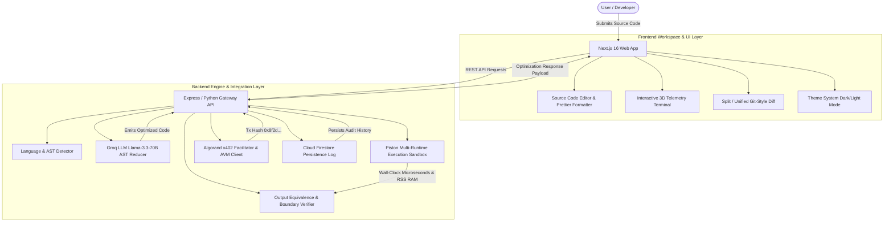

# ⚡ Optima AI — Autonomous Code Optimization Platform

[](https://nextjs.org/)
[](https://react.dev/)
[](https://www.typescriptlang.org/)
[](https://tailwindcss.com/)
[](https://groq.com/)
[](https://www.algorand.com/)
[](https://github.com/engineer-man/piston)
[](LICENSE)

**Optima AI** is an enterprise-grade, autonomous code optimization and performance auditing platform. Powered by Groq Llama-3.3 70B LLM AST reduction, multi-runtime Piston execution sandboxes, and the Algorand x402 micropayment settlement protocol, Optima AI analyzes codebases, eliminates algorithmic bottlenecks, verifies output equivalence, and calculates wall-clock millisecond speedups.

---

## 🌟 Key Features

- 🧠 **Groq Llama-3.3 70B AST Reduction**: Automatically refactors algorithmic bottlenecks (e.g. $O(n^2)$ Bubble Sort to $O(n \log n)$ Timsort/QuickSort), performs dead-code elimination, prunes heap allocations, and vectorizes loops.
- 🧪 **Piston Execution Sandbox**: Executes original vs. optimized code in real-time sandboxes to measure wall-clock latency, peak RSS memory consumption, and CPU cycle deltas across 10+ runtimes (Python, C++, Rust, Go, Java, TypeScript, JavaScript).
- 🔒 **Algorand x402 Micropayment Protocol**: Decentralized micro-payment challenge & response protocol verified on the Algorand testnet via Plausible facilitator with SHA-256 cryptographic receipt digests.
- 💻 **Cursor IDE-Style Workspace**: Interactive source code editor with live Split/Unified diff views, stdin execution support, AI test case generation, AI Copilot chat assistant, and Prettier code formatting.
- 🎨 **Adaptive Theme System**: Theme engine supporting dark and light modes with custom semantic tokens, smooth CSS transitions, interactive 3D floating Finder terminal canvas, and a 60 FPS infinite live telemetry marquee.
- 📊 **Deep Performance Analytics**: 8-axis architecture radar, execution curve line charts, CPU utilization timeline, memory RSS profile, and exportable audit reports (JSON, Markdown, CSV, HTML).

---

## 📐 System Architecture



---

## 🗂️ Project Structure

```
SML-Code-Optimiser/
├── frontend/                     # Next.js 16 App Router Frontend
│   ├── app/
│   │   ├── components/           # UI Components
│   │   │   ├── Hero3DTerminal.tsx # 3D Floating Finder Window Stack
│   │   │   ├── InteractiveDotGrid.tsx # Interactive Canvas Background
│   │   │   ├── LiveMetricsMarquee.tsx # 60 FPS Infinite Telemetry Marquee
│   │   │   ├── ThemeProvider.tsx # Theme Context & LocalStorage Sync
│   │   │   ├── ThemeToggle.tsx   # Smooth Sun/Moon Theme Switcher
│   │   │   └── compiler-tree/    # Compiler Architecture Visualizer
│   │   ├── workspace/            # Source Code Workspace (IDE)
│   │   ├── results/              # Detailed Benchmark & Audit Reports
│   │   ├── dashboard/            # Optimization History & Analytics
│   │   ├── history/              # Persistent Execution Records
│   │   ├── settings/             # System Preferences & API Config
│   │   ├── globals.css           # Semantic Color System & Design Tokens
│   │   ├── layout.tsx            # Global Navigation & Layout Shell
│   │   └── page.tsx              # Viewport-Constrained Hero Landing Page
│   ├── lib/                      # Client Utilities & Formatters
│   │   ├── prettierFormatter.ts  # Prettier Formatting Utility
│   │   ├── languageDetector.ts   # Client-Side Language Detection
│   │   └── x402/                 # Algorand AVM Client & Fetch Wrappers
│   ├── .prettierrc               # Prettier Options Configuration
│   └── package.json
│
├── backend/                      # Node.js / Express TypeScript Gateway API
│   ├── src/
│   │   ├── services/
│   │   │   ├── groq.ts           # Groq Llama-3.3-70B API Integration
│   │   │   ├── piston.ts         # Piston Code Execution Sandbox
│   │   │   ├── payment.ts        # Algorand x402 Micropayment Engine
│   │   │   ├── detector.ts       # Code AST & Language Detector
│   │   │   ├── verifier.ts       # Output Equivalence Verification
│   │   │   ├── compiler.ts       # Multi-Compiler Backend Flags
│   │   │   └── firebase.ts       # Cloud Firestore Audit Persistence
│   │   ├── config.ts             # Environment Settings & API Keys
│   │   └── index.ts              # Express Server Entry Point & Routes
│   ├── package.json
│   └── tsconfig.json
│
├── routes/                       # Modular FastAPI / Python Routes
├── services/                     # Python Optimization Service Layer
├── config.py                     # Python Runtime Configuration
├── main.py                       # Python API Entrypoint
└── README.md
```

---

## ⚡ Quick Start & Setup

### Prerequisites

Ensure you have the following installed on your machine:
- **Node.js**: v18.0.0 or higher
- **npm**: v9.0.0 or higher
- **Python**: 3.10+ (if running Python backend services)
- **Git**

---

### 1. Clone the Repository

```bash
git clone https://github.com/badgujarkunal93-blip/SML-Code-Optimiser.git
cd SML-Code-Optimiser
```

---

### 2. Configure Backend Server

```bash
cd backend
npm install
```

Create a `.env` file in `backend/`:

```env
PORT=3001
NODE_ENV=development
GROQ_API_KEY=your_groq_api_key_here
PISTON_API_URL=https://emkc.org/api/v2/piston
ALGORAND_ALGOD_SERVER=https://testnet-api.algonode.cloud
ALGORAND_ALGOD_PORT=443
DEV_BYPASS_PAYMENT=true
```

Start the backend API server:

```bash
npm run dev
```
The Express server will start on `http://localhost:3001`.

---

### 3. Configure Frontend Application

In a new terminal window, navigate to `frontend/`:

```bash
cd frontend
npm install
```

Create a `.env.local` file in `frontend/`:

```env
NEXT_PUBLIC_API_URL=http://localhost:3001
NEXT_PUBLIC_DEV_BYPASS_PAYMENT=true
```

Start the Next.js development server:

```bash
npm run dev
```

Open [http://localhost:3000](http://localhost:3000) in your desktop browser.

---

## 🛠️ API Reference

### `POST /api/optimize`
Submits source code for Groq LLM AST reduction and execution benchmarking.

**Request Body:**
```json
{
  "code": "def bubble_sort(a): ...",
  "language": "python",
  "stdin": ""
}
```

**Response Payload:**
```json
{
  "optimizedCode": "def quick_sort(a): ...",
  "timeComplexity": { "original": "O(n²)", "optimized": "O(n log n)" },
  "metrics": {
    "originalTimeMs": 142.5,
    "optimizedTimeMs": 12.8,
    "improvementPct": 91.0
  },
  "optimizationConfidence": 98.8,
  "reasoning": "Replaced O(n²) Bubble Sort with native O(n log n) Timsort routine..."
}
```

### `POST /api/execute`
Executes raw code in isolated Piston sandboxes with optional stdin input.

### `GET /api/history`
Fetches persisted optimization records from Cloud Firestore.

---

## 🎨 Theme System & Customization

Optima AI features a dual theme engine powered by CSS variables (`var(--bg)`, `var(--primary)`, `var(--card)`):

- **Dark Mode**: Deep navy canvas (`#07101A`), glowing cyan accents (`#2DD4BF`), dark code frames (`#111827`).
- **Light Mode**: Warm off-white canvas (`#F7FAFC`), crisp dark navy headlines (`#0B1720`), deep rich teal accents (`#0D9488`), and light surface cards (`#FFFFFF`).

---

## 📄 Prettier Code Formatting

The source code editor includes built-in Prettier formatting via `frontend/lib/prettierFormatter.ts`. Click the **⚡ Prettier Format** button in the Workspace IDE header to format JavaScript, TypeScript, Python, or JSON source snippets according to [.prettierrc](file:///Users/sukrutdusane/Documents/Projects%20/Sy/SML-Code-Optimiser/frontend/.prettierrc).

---

## 📜 License

This project is licensed under the [MIT License](LICENSE).

---

<p align="center">
  <b>Optima AI</b> — Enterprise Autonomous Code Optimization Platform
</p>
