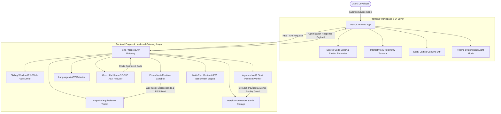

# ⚡ Optima AI — Autonomous Code Optimization Platform

[](https://nextjs.org/)
[](https://react.dev/)
[](https://www.typescriptlang.org/)
[](https://tailwindcss.com/)
[](https://groq.com/)
[](https://www.algorand.com/)
[](https://github.com/engineer-man/piston)
[](LICENSE)

**Optima AI** is a hardened, autonomous code optimization and performance auditing platform. Powered by Groq Llama-3.3 70B LLM AST reduction, multi-runtime Piston execution sandboxes, and the Algorand x402 micropayment settlement protocol, Optima AI analyzes codebases, eliminates algorithmic bottlenecks, performs empirical behavioral equivalence testing, and calculates statistically robust median speedups across multi-run benchmarks.

---

## 🌟 Key Hardened Features

- 🧠 **Groq Llama-3.3 70B AST Reduction**: Automatically refactors algorithmic bottlenecks (e.g. $O(n^2)$ Bubble Sort to $O(n \log n)$ Timsort/QuickSort), performs dead-code elimination, prunes heap allocations, and vectorizes loops.
- 🧪 **Empirical Behavioral Equivalence Testing**: Replaces unproven "formal verification" claims with empirical multi-case behavioral equivalence verification across boundary cases (empty input, min/max int), edge cases (sorted arrays, duplicates, negative numbers), and language-aware fuzz inputs.
- ⏱️ **Multi-Run Median Benchmarking**: Primed container warmup runs followed by 10+ measurement runs collecting Median, Min, Max, P95 Percentile, and Standard Deviation. Speedup percentage is reported using **MEDIAN** as the headline metric.
- 🔒 **Algorand x402 Micropayment Protocol**: Cryptographically bound challenge-response payment protocol verified on the Algorand testnet via Plausible facilitator.
  - **12-Rule Verification Gate**: Strictly checks confirmation round (`confirmedRound > 0`), non-failed transaction status, receiver address, USDC asset ID, payment amount, challenge expiration, and request payload cryptographic binding (`SHA256(requestId + codeHash + language + amount + receiver + assetId)`).
  - **Persistent Replay Protection**: Single-use transaction IDs enforced via atomic database inserts that persist across server restarts.
- 🛡️ **Production Bypass Fail-Fast**: Application fails fast on startup if `DEV_BYPASS_PAYMENT=true` is enabled in `NODE_ENV=production`.
- 💻 **Cursor IDE-Style Workspace**: Interactive source code editor with live Split/Unified diff views, stdin execution support, AI test case generation, AI Copilot chat assistant, and Prettier code formatting.
- 🎨 **Adaptive Theme System**: Theme engine supporting dark and light modes with custom semantic tokens, smooth CSS transitions, interactive 3D floating Finder terminal canvas, and a 60 FPS infinite live telemetry marquee.
- 📊 **Deep Performance Analytics**: 8-axis architecture radar, execution curve line charts, CPU utilization timeline, memory RSS profile, and exportable audit reports (JSON, Markdown, CSV, HTML).

---

## 📐 System Architecture



---

## 🗂️ Project Structure

```
SML-Code-Optimiser/
├── frontend/                     # Next.js 16 App Router Frontend
│   ├── app/
│   │   ├── components/           # UI Components
│   │   │   ├── Hero3DTerminal.tsx # 3D Floating Finder Window Stack
│   │   │   ├── InteractiveDotGrid.tsx # Interactive Canvas Background
│   │   │   ├── LiveMetricsMarquee.tsx # 60 FPS Infinite Telemetry Marquee
│   │   │   ├── WorkflowSection.tsx # How Optima AI Works Workflow Infographic
│   │   │   ├── ThemeProvider.tsx # Theme Context & LocalStorage Sync
│   │   │   └── ThemeToggle.tsx   # Smooth Sun/Moon Theme Switcher
│   │   ├── workspace/            # Source Code Workspace (IDE)
│   │   ├── results/              # Detailed Benchmark & Audit Reports
│   │   ├── dashboard/            # Optimization History & Analytics
│   │   └── history/              # Persistent Execution Records
│   ├── lib/                      # Client Utilities & Formatters
│   │   └── x402/                 # Algorand AVM Client & Fetch Wrappers
│   └── package.json
│
├── backend/                      # Node.js / Hono TypeScript Gateway API
│   ├── src/
│   │   ├── services/
│   │   │   ├── db.ts             # Persistent DB & Atomic Replay Storage
│   │   │   ├── payment.ts        # Algorand x402 12-Rule Micropayment Engine
│   │   │   ├── verifier.ts       # Empirical Behavioral Equivalence Testing
│   │   │   ├── benchmark.ts      # Warmup + 10-Run Median Benchmarking
│   │   │   ├── groq.ts           # Groq Llama-3.3-70B API & Retries
│   │   │   ├── piston.ts         # Piston Execution Sandbox & Retries
│   │   │   ├── detector.ts       # Code AST & Language Detector
│   │   │   └── firebase.ts       # Cloud Firestore Audit Persistence
│   │   ├── tests/
│   │   │   └── hardening.test.ts # Hardening Automated Test Suite
│   │   ├── config.ts             # Environment Settings & Fail-Fast Rules
│   │   └── index.ts              # API Gateway & Route Contracts
│   └── package.json
│
├── .env.example                  # Environment Configuration Template
└── package.json                  # Monorepo Scripts
```

---

## ⚡ x402 Micropayment Lifecycle

```
Client                              Gateway API                       Algorand Testnet / DB
  │                                     │                                       │
  ├─── 1. POST /payment/challenge ─────►│                                       │
  │    (code, language, wallet)         ├── Compute SHA256 Payload Hash ───────►│ (Store Challenge)
  │◄── 2. Payment Challenge Details ────┤                                       │
  │    (amount, receiver, requestId)    │                                       │
  │                                     │                                       │
  ├─── 3. Sign & Submit Tx USDC ───────────────────────────────────────────────►│ (Confirmed)
  │                                     │                                       │
  ├─── 4. POST /optimize ──────────────►│                                       │
  │    (X-Payment-TxID, requestId, code)├── 5. Verify 12 Strict Rules ─────────►│
  │                                     │   - confirmedRound > 0                │
  │                                     │   - receiver & asset match            │
  │                                     │   - amount >= expected                │
  │                                     │   - payloadHash matches code          │
  │                                     │   - Atomic Replay Check ──────────────┤ (Mark Consumed)
  │                                     ├── 6. Groq AST Optimization           │
  │                                     ├── 7. Sandbox Execution (Piston)       │
  │                                     ├── 8. Multi-Case Equivalence Test      │
  │                                     ├── 9. Warmup + 10-Run Median Benchmark │
  │◄── 10. Measured Optimization ───────┤                                       │
```

---

## 🚀 Development Setup & Running

### 1. Clone & Install Dependencies

```bash
git clone https://github.com/badgujarkunal93-blip/SML-Code-Optimiser.git
cd SML-Code-Optimiser
npm install
npm --prefix backend install
npm --prefix frontend install
```

### 2. Environment Configuration

Copy `.env.example` to `.env`:

```bash
cp .env.example .env
```

Ensure `.env` contains:

```env
NODE_ENV=development
PORT=3001
DEV_BYPASS_PAYMENT=true
ALGORAND_NETWORK=testnet
ALGORAND_API_URL=https://testnet-api.algonode.cloud
USDC_ASSET_ID=31566704
ALGORAND_SERVICE_ADDRESS=AAAAAAAAAAAAAAAAAAAAAAAAAAAAAAAAAAAAAAAAAAAAAAAAAAAAAAAAAAAAAAA
REQUIRED_PAYMENT_AMOUNT=0.001
GROQ_API_KEY=your_groq_api_key
PISTON_URL=https://emkc.org/api/v2/piston
MAX_SOURCE_CODE_BYTES=100000
BENCHMARK_WARMUP_RUNS=3
BENCHMARK_MEASUREMENT_RUNS=10
```

### 3. Run Development Servers

```bash
npm run dev
```

- Backend API: `http://localhost:3001`
- Frontend Web App: `http://localhost:3000`

---

## 🧪 Testing & Validation Commands

Run the full automated hardening verification test suite:

```bash
npx tsx backend/src/tests/hardening.test.ts
```

Run TypeScript compilation checks:

```bash
npm run build
```

---

## 📜 License

Distributed under the MIT License. See `LICENSE` for more information.
